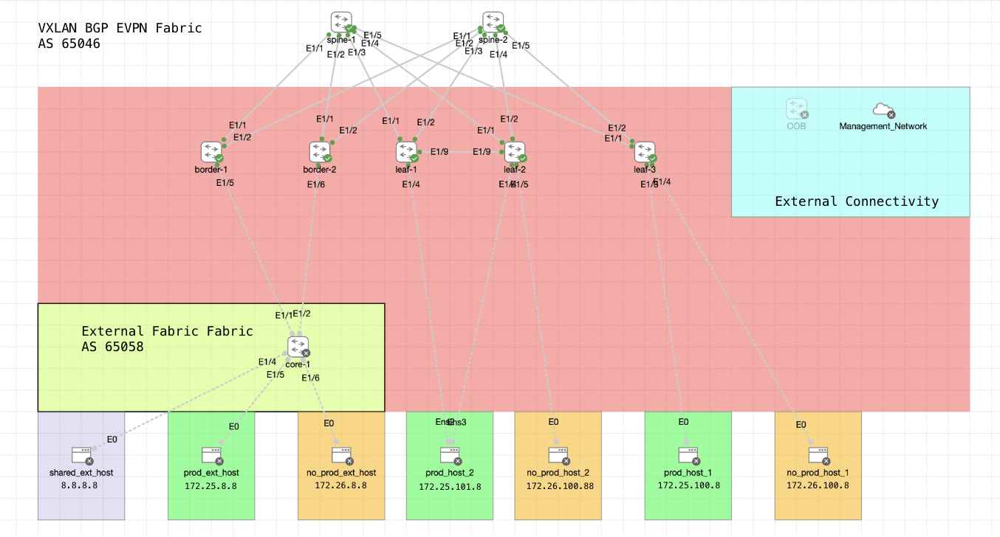

# Cisco Datacenter Networking Business Unit - Datacenter Networking Automation - Partner Essentials Workshop



## Overview

This repository contains the **VXLAN BGP EVPN Single Site CML Topology** designed for use with **Cisco Network Services Orchestrator (NDFC)**. This guide walks you through setting up the topology and managing it with Terraform.

---

## Prerequisites

Before proceeding, ensure the following requirements are met:

1. **Repository Files**  
   - Clone or download the repository containing the necessary topology files.

2. **Terraform**  
   - Install Terraform (minimum version: **1.3**). You can download it [here](https://www.terraform.io/downloads.html).  
   - Verify the installation using:
     ```bash
     terraform --version
     ```

3. **Environment Configuration**  
   - Fill in the `provider.auto.tfvars` file with your environment-specific management details.  
     This ensures the Nexus 9000v devices boot with the correct `mgmt0` interface IPs and gateways.

   Example snippet for `provider.auto.tfvars`:
   ```hcl
   state = "DEFINED_ON_CORE"
   device_gateway = "<your-management-ip>"
   leaf_1_ip = "<your-gateway-ip>"
   ```
   Ensure these values reflect your lab's architecture.

4. **Network Connectivity**  
   - The `mgmt0` interface of the virtual Nexus 9000 is extended via an **external network/VLAN**.  
   - The CML virtual topology includes an **External Connector** that trunks/extends the network/VLAN to your real/outside environment.  
   - Ensure your **NDFC node/cluster** can reach these `mgmt0` interfaces for proper functionality.

   ⚠️ **Note:** Since each lab architecture varies, you may need to adapt the external network setup to fit your environment.

---

## Deployment Steps

Follow these steps to deploy and manage the VXLAN BGP EVPN topology:

1. **Initialize Terraform**  
   Run the following command to initialize Terraform and download necessary provider plugins:
   ```bash
   terraform init
   ```

2. **Plan the Deployment**  
   Preview the actions Terraform will take to deploy the topology:
   ```bash
   terraform plan
   ```

3. **Apply the Configuration**  
   Deploy the topology by applying the configuration:
   ```bash
   terraform apply
   ```
   Confirm when prompted.

4. **Destroy the Topology (When Done)**  
   Clean up the deployment by destroying all resources:
   ```bash
   terraform destroy
   ```

---

## Caveats and Performance Considerations

- **CPU Usage During Initialization**  
  Bringing up the full topology requires around **45-50 GHz** of CPU cycles.  
  After approximately 10 minutes, CPU usage will normalize to around **10 GHz**.  
  If your system has limited resources, consider the following options:
  - Uncomment the `state = "DEFINED_ON_CORE"` line in the `provider.auto.tfvars` file. This will load the topology with all nodes in a **shutdown state**, allowing you to power on nodes incrementally. Example:
    ```yaml
    state = "DEFINED_ON_CORE"
    ```

- **Avoid CPU Saturation**  
  It is critical to avoid saturating the CPU, as this can prevent nodes from booting up correctly. Monitor your CPU usage during the deployment process.

---

## Additional Tips

- **Troubleshooting Connectivity**  
  - Verify that the `mgmt0` interfaces of the Nexus 9000v devices are reachable from your **NDFC node/cluster**.
  - Use tools like `ping` or `telnet` to confirm connectivity.

- **Documentation and Help**  
  - Refer to the official [Terraform Documentation](https://www.terraform.io/docs) for troubleshooting Terraform-specific issues.
  - Check the CML documentation for details about virtual topologies and External Connectors.

---

By following these steps and guidelines, you should be able to deploy and manage the VXLAN BGP EVPN topology successfully. If you encounter any issues, feel free to reach out to your Cisco support contact.

